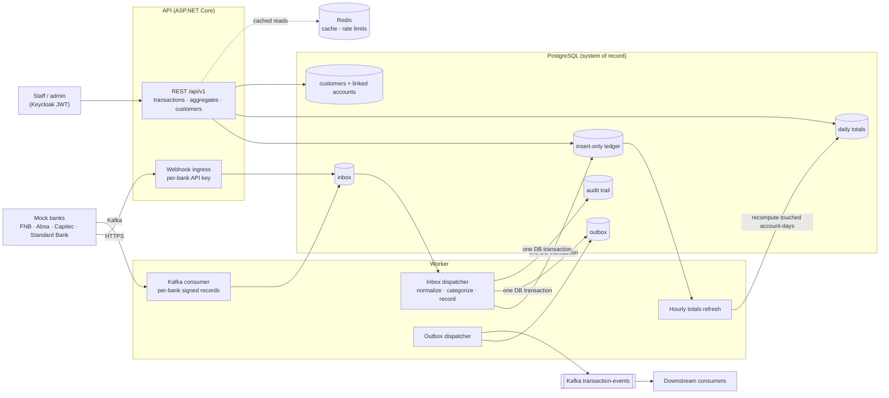

# Transaction Aggregation API

A .NET 10 modular monolith that receives posted bank transactions from several (mock) banks,
deduplicates, normalizes and categorizes them, records them in an insert-only PostgreSQL ledger,
publishes each one as an integration event, and serves them through a secured, versioned REST API
with aggregates by customer, bank, account, category and period.

A customer's accounts at different banks can be linked to them, so one person's money can be
aggregated across banks. Staff (scoped to their banks) and administrators sign in; customers don't.
Nothing in the ledger is ever edited or deleted.

**Contents:** [Highlights](#highlights) · [Quick start](#quick-start) ·
[Architecture](#architecture) · [Design decisions](#design-decisions) · [API](#api) ·
[Categorization](#categorization) · [Testing and CI](#testing-and-ci) ·
[Requirements coverage](#requirements-coverage) · [Known limitations](#known-limitations) ·
[Documentation](#documentation)

---

## Highlights

- **Two ingestion channels, one inbox.** Bank deliveries arrive by REST webhook (one API key per
  bank) or Kafka (per-record ECDSA signature checked against the bank's registered public key).
- **Exactly-once effects under at-least-once delivery.** Deliveries are deduplicated by idempotency
  key or payload hash, and the database enforces one ledger row per institution, account and bank
  transaction id. The inbox's "processed" mark commits in the same transaction as the rows it
  produces.
- **Immutable ledger.** Only postings are recorded; pending notices are audited and skipped. A
  trigger and the application role's grants make `UPDATE`, `DELETE` and `TRUNCATE` impossible,
  whoever asks.
- **Normalization and categorization.** Each bank's format maps to one canonical model; categories
  come from configurable keyword rules.
- **Events out.** `TransactionRecorded` v1 is published to the Kafka `transaction-events` topic
  through the outbox, keyed by account, with trace and correlation headers.
- **Customers across banks.** A link is the (bank, account id) pair every transaction already
  carries, resolved on each read, so the ledger never changes when a link does.
- **Secured, scoped API.** Keycloak JWTs: `staff` reads the banks in their `institutions` claim,
  `admin` reads everything and manages. Every list uses cursor pagination with index-backed sorting.
- **Aggregates off the request path.** The worker rebuilds a daily read model hourly (configurable);
  every aggregate says how old it is (`asOf`) and is computed in one ISO 4217 currency at a time.
- **Full audit trail.** Every inbound delivery, ledger entry and admin change (with its actor) is
  written to an append-only trail in the same transaction as the change.

---

## Quick start

Requires Docker Desktop. From `TransactionAggregationAPI/`:

```bash
cp .env.template .env                           # once: fill in the credentials (git-ignored)
docker compose up --build                       # the system
docker compose --profile tools up --build       # + pgAdmin, Redis Commander, Kafka UI
docker compose --profile monitoring up --build  # + Prometheus, Grafana
docker compose down -v                          # stop and wipe all data
```

In Development the API applies migrations and seeds demo accounts on start. Elsewhere, a gated
migration Job applies them before the API rolls out.

| Service | URL |
|---|---|
| UI | http://localhost:7200 |
| API | http://localhost:5001 (`/api/v1/...`) |
| API reference (Scalar, Development only) | http://localhost:5001/scalar/v1 |
| Health | `/liveness` (process), `/readiness` (PostgreSQL reachable), `/health` |
| Keycloak | http://localhost:8081 |
| Mock bank aggregator | http://localhost:5090 |
| Seq (logs) | http://localhost:5341 |

Run only one stack at a time: Docker Compose and the Aspire AppHost both publish Keycloak on port
8081, and tokens from one are rejected by the other's API.

No credential is committed. Compose reads them from `.env`; the .NET hosts read a git-ignored
`secrets.json`, which Vault renders in clusters. Demo logins and seed data are in the
[detailed guide](TransactionAggregationAPI/README.md#seed-data).

| To… | Use |
|---|---|
| Debug with breakpoints and the Aspire dashboard | run `TransactionAggregationAPI.AppHost` ([guide](TransactionAggregationAPI/README.md#option-b--net-aspire-debug)) |
| Deploy to Kubernetes | `deploy-k8s.sh`, which refuses to run while `k8s/secrets.yaml` still holds placeholders ([guide](TransactionAggregationAPI/README.md#option-c--kubernetes-rancher-desktop)) |

---

## Architecture



The system is one deployable API, one background worker, and four modules with explicit
boundaries. Each module has its own PostgreSQL schema and migrations. Modules talk to each other
only through `*.Contracts` interfaces, and architecture tests enforce that.

| Module | Owns |
|---|---|
| Transactions | ingestion pipeline, the insert-only ledger, the daily read model, queries and aggregates (including per customer), the `TransactionRecorded` contract |
| Customers | customers and the bank accounts linked to them; resolves a customer to its accounts for other modules |
| WebhookSources | the banks: one source per bank, its API key, display name and Kafka signing key |
| Audit | the append-only audit trail of deliveries, ledger entries and admin changes |

### Moving parts

The brief needs aggregation, mock sources, categorization and an API; PostgreSQL and the API alone
cover that. Everything else is here for a reason, or is optional:

| Component | Role | Required? |
|---|---|---|
| PostgreSQL | System of record: ledger, inbox, outbox, read model, audit | Yes |
| API | Webhook ingress and the REST API | Yes |
| Worker | Inbox and outbox dispatch, Kafka consumer, hourly totals refresh; runs apart so ingestion can't slow the API and scales on its own | Yes |
| Kafka | Signed per-bank inbound records, and the outbound `TransactionRecorded` events | Publishing needs it; inbound is optional (`Kafka:Enabled=false` leaves webhooks to carry ingestion) |
| Redis | Response cache and distributed rate limits; never authoritative. When it's down, reads run uncached and events still publish | Optional |
| Keycloak | Real OIDC, so roles and per-bank scoping are tested end to end | Yes |
| Prometheus, Grafana, Seq | Dashboards, the alert rules in `monitoring/prometheus-rules.yml`, searchable logs | Optional |
| Aspire, Compose, Kubernetes manifests, Vault | Three ways to run it locally, and how secrets are rendered in a cluster. Compose alone runs everything | Optional |

---

## Design decisions

| Decision | Why | What it costs | Simpler alternative, and why not |
|---|---|---|---|
| Modular monolith | One deployable and one database transaction across modules; boundaries still enforced by tests | Modules scale together | Microservices: distributed transactions and ops for no current load |
| Inbox and outbox in PostgreSQL, polled | A delivery is acknowledged only once durably stored; the ledger rows, their events and the "processed" mark commit atomically, so a crash can't half-apply a delivery | Up to one poll interval (5 s) of latency; polling load | Process inline in the webhook: a crash between insert and acknowledgement loses or duplicates data |
| Idempotency enforced by the database | Unique (bank, account, bank's transaction id) over the ledger, and (source, idempotency key) over the inbox. Two workers racing on the same delivery can't both insert; the loser re-checks and records a duplicate | A unique index on the hot write path | Check-then-insert in code: the race in the brief's own example |
| Insert-only ledger | Financial history is never rewritten; triggers and grants refuse `UPDATE`/`DELETE` to everyone | A correction is a new entry, not an edit | Mutable rows: simpler, but history can be lost |
| Aggregates from a daily read model rebuilt hourly | Dashboard load can't compete with ingestion; each read is a small range scan | Totals up to one rebuild old (`asOf` says how old) | `GROUP BY` per request: always fresh, but cost grows with the ledger and its cache is cleared on every new transaction |
| Customers link accounts; resolved at read time | A person's money across banks without touching the ledger; linking takes effect immediately, history included | One extra lookup per customer read; at most 50 accounts per customer | A `CustomerId` on each transaction: needs updates to an insert-only ledger and breaks when links change |
| Keyset pagination everywhere | Page N costs the same as page 1 on a growing ledger, and inserts don't shift pages | No "jump to page 37" | Offset: slower with every page and skips or repeats rows under inserts |
| Least-privilege database roles | A schema-owning migrator and a DML-only application role | Two connection strings to manage | One owner role: a compromised app could alter the schema |
| Each bank is a source; its key decides the bank | A delivery can't claim another bank's identity | One key per bank to rotate | A shared key with the bank named in the payload: any bank could write for any other |
| Staff scope enforced in the application | Staff see only their assigned institutions on every read path | Not defence in depth at the database | Row-level security: needs the caller's banks set on every pooled transaction |
| No partitioning, no saga | Volumes fit one table with the right indexes; no workflow spans separately committed steps | Revisit at roughly 100M ledger rows | |
| Migrations never change data or block writes | Every index built `CONCURRENTLY`, expand/contract only; a policy test fails the build otherwise | Two-step changes where one would do | |

Smaller choices: any ISO 4217 currency with one currency per aggregate; an untracked
`secrets.json` locally, rendered by Vault in clusters.

---

## API

Every route is under `/api/v1`. Reads need the `staff` or `admin` realm role; changes and the admin
routes need `admin`; staff are confined to their banks.

| Area | Routes |
|---|---|
| Transactions | list (filters, search, sorting), detail, summary |
| Aggregates | institutions, categories, cash flow, period comparison, each also per customer |
| Customers | list, detail, register, link and unlink accounts |
| Banks | the banks the caller may read; admins manage webhook sources |
| Audit | inbound deliveries and transaction lineage (admin) |
| Ingestion | per-bank webhook; Kafka records |

Every list returns `{ items, pageSize, nextCursor, hasMore, totalCount, totalCountCapped }`; pass
`nextCursor` back as `cursor`. Endpoints and schemas are in the OpenAPI document
(`/openapi/v1.json`, browsable through Scalar in Development). The webhook payload, the Kafka
record format (including how to sign a record) and the `TransactionRecorded` event are in the
[API reference](TransactionAggregationAPI/README.md#api-reference).

### Categorization

Rules live in `TransactionAggregation.Hosting/categorization-rules.json`, so adding a keyword needs
no code change. A keyword matches whole words in the description, and the longest matching keyword
wins. If nothing matches, the bank's own category is used. Failing that, positive amounts are
`Income` and the rest `Uncategorized`. The category is decided once, when the transaction is stored,
and never changes afterwards.

---

## Testing and CI

```bash
cd TransactionAggregationAPI
dotnet test
```

About 780 test cases: unit, architecture, contract, API (in-process host), and integration against
real PostgreSQL, Redis and Kafka through Testcontainers, so Docker must be running.

CI (`.github/workflows/ci-cd.yml`) runs:

- formatting, a warnings-as-errors build, a dependency vulnerability scan and a migration drift check
- the tests, and gitleaks for secrets
- image builds with a non-root check, Trivy, and an SBOM
- Kubernetes manifest and alert-rule validation, and a compose smoke test

---

## Requirements coverage

> *Build a system that aggregates customer financial transaction data from multiple mock data
> sources and categorizes the transactions. It will need an extensive API for retrieving
> aggregated information.*

How each phrase is read:

- **Customer.** The person whose money it is. A customer holds accounts at several banks;
  administrators link those accounts to the customer, and every list and aggregate can be narrowed
  to one customer. Customers are not users: the API's callers are staff and administrators.
- **Multiple mock data sources.** Four mock banks (FNB, Absa, Capitec, Standard Bank), each with its
  own wire format, delivered by webhook or Kafka. `TransactionAggregation.MockAggregator` produces
  their feeds.
- **Aggregates.** Totals by customer, bank, account, category and period, never mixing currencies,
  rebuilt hourly from the ledger. Read-time aggregation was rejected so dashboard load can't compete
  with ingestion; the cost is that totals may be up to one rebuild old, and every response says how
  old (`asOf`).
- **Extensive API.** Transactions (list, detail, search, filters, keyset paging), four aggregate
  views plus a summary, the same views per customer, and administration of banks and customers.

| Requirement | Implemented by | Verified by |
|---|---|---|
| Aggregates **customer** transaction data | `Modules/Customers`, `Transactions.Presentation/Endpoints/Customers/CustomerTransactions.cs` | `Integration/CustomerApiTests.cs`, `Integration/Postgres/CustomerPostgresTests.cs` |
| From **multiple mock data sources** | `TransactionAggregation.MockAggregator`, webhook and Kafka ingestion, per-bank normalization rules | `Integration/MockBanks/MockBankFormatsTests.cs`, `Integration/WebhookApiIntegrationTests.cs`, `Integration/Kafka/KafkaConsumerBrokerTests.cs` |
| **Categorizes** the transactions | `categorization-rules.json`, `TransactionCategorizationService` | `Unit/Services/TransactionCategorizationServiceTests.cs` |
| **Extensive API** for aggregated information | `Queries/Aggregates/*`, `PostgresDailyTotalsRefresher` | `Integration/Postgres/TransactionAggregatesPostgresTests.cs`, `Integration/Postgres/DailyTotalsRefresherPostgresTests.cs`, `Integration/RoleAccessTests.cs` |

Test paths are under `TransactionAggregationAPI/TransactionAggregation.Tests/`.

---

## Known limitations

- **Stale totals.** Totals are up to one rebuild old (hourly by default; `asOf` says how old). A
  failed rebuild is retried after 30 s, doubling up to the interval, and `TransactionAggregatesStale`
  fires if none succeeds for two hours.
- **Best-effort cache invalidation.** If Redis is unreachable when a transaction is recorded, the
  event is still published, and a ledger read cached just before the outage can be up to its 5-minute
  TTL stale. Nothing is cached while Redis is down.
- **Event ordering.** The outbox publishes up to 16 events at once, so two events for the same
  account in one batch can reach Kafka in either order. Consumers should order by
  `BookedAt`/`RecordedAt`, not arrival.
- **Staff scope in the application.** It is enforced there, not by PostgreSQL row-level security (which
  would need the caller's banks set on every pooled transaction).
- **No currency conversion.** Aggregates never mix currencies, by design.
- **Deployment.** The CI deploy stage is a notice, not an automated deployment. Third-party images
  are pinned by tag, not digest.

---

## Documentation

| Where | What |
|---|---|
| [`TransactionAggregationAPI/README.md`](TransactionAggregationAPI/README.md) | The detailed guide: project structure, seed data and logins, running with [Compose](TransactionAggregationAPI/README.md#option-a--docker-compose-quickest), [Aspire](TransactionAggregationAPI/README.md#option-b--net-aspire-debug) or [Kubernetes](TransactionAggregationAPI/README.md#option-c--kubernetes-rancher-desktop), the [API reference](TransactionAggregationAPI/README.md#api-reference), [configuration](TransactionAggregationAPI/README.md#configuration-reference) and [troubleshooting](TransactionAggregationAPI/README.md#troubleshooting) |
| [`TransactionAggregationAPI/k8s/README.md`](TransactionAggregationAPI/k8s/README.md) | Kubernetes manifests |
| [`TransactionAggregationAPI/perf/README.md`](TransactionAggregationAPI/perf/README.md) | k6 load tests |
| [`Goal.md`](Goal.md), [`Instructions.md`](Instructions.md) | The longer build prompts this system was developed against (the brief itself is the two sentences quoted under Requirements coverage) |

Licensed under the terms in [`LICENSE`](LICENSE).
