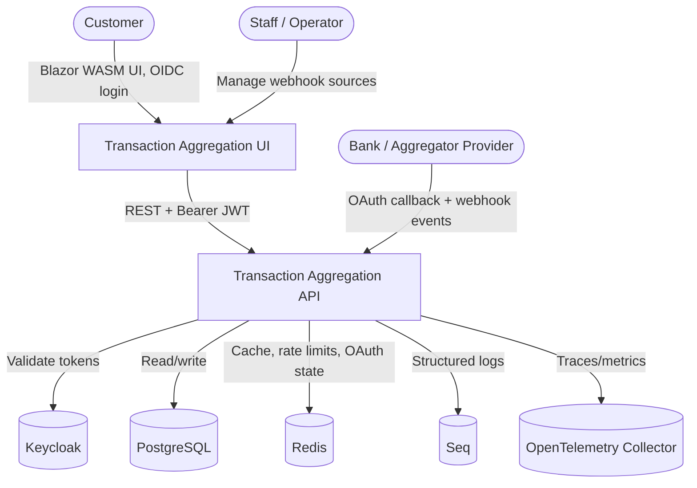
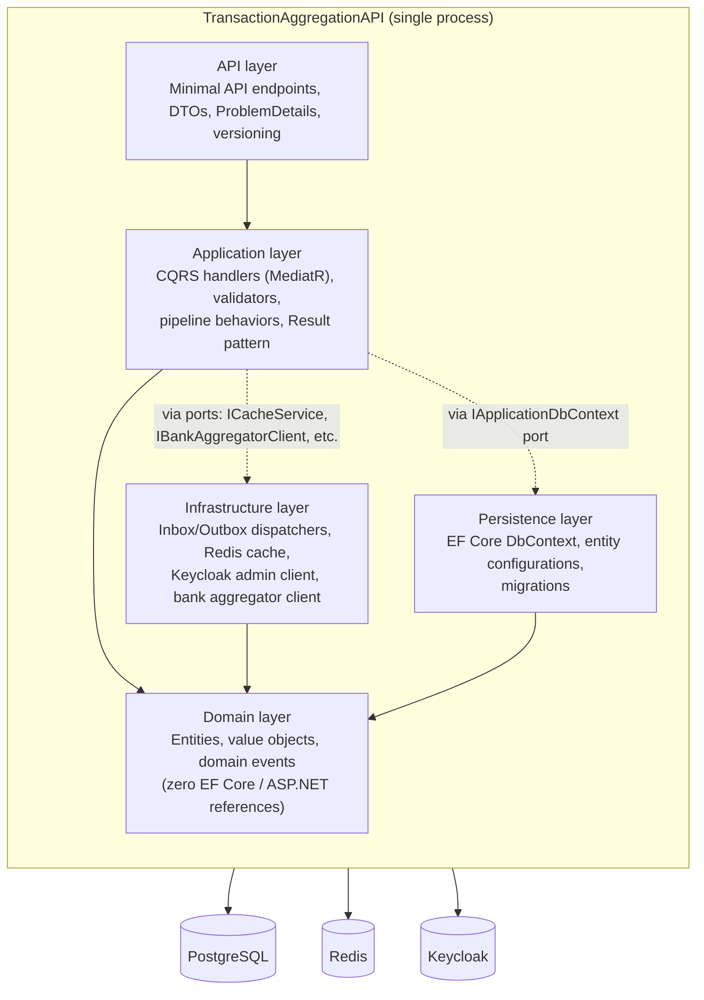
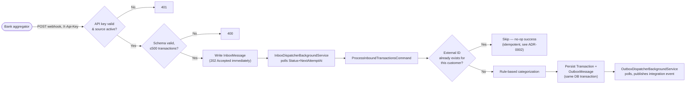
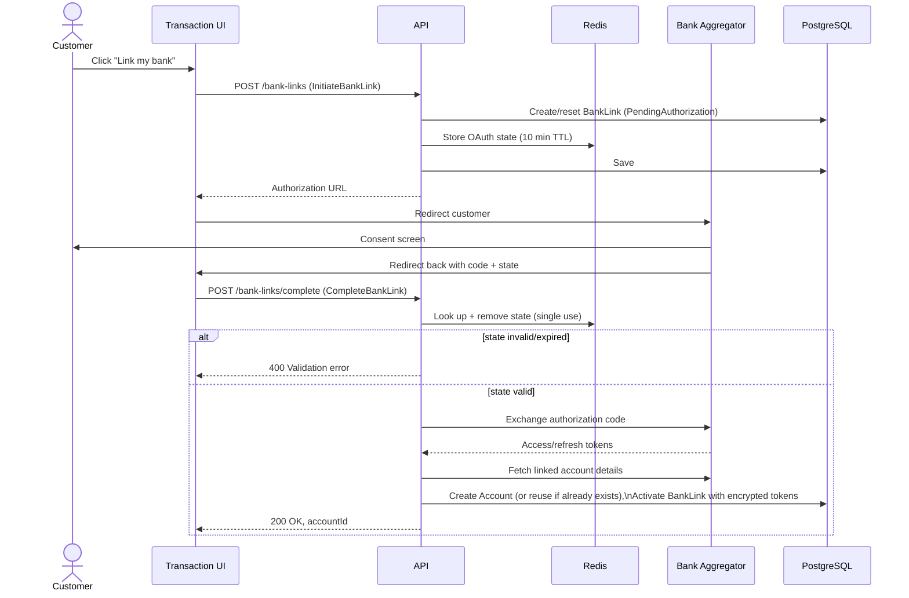
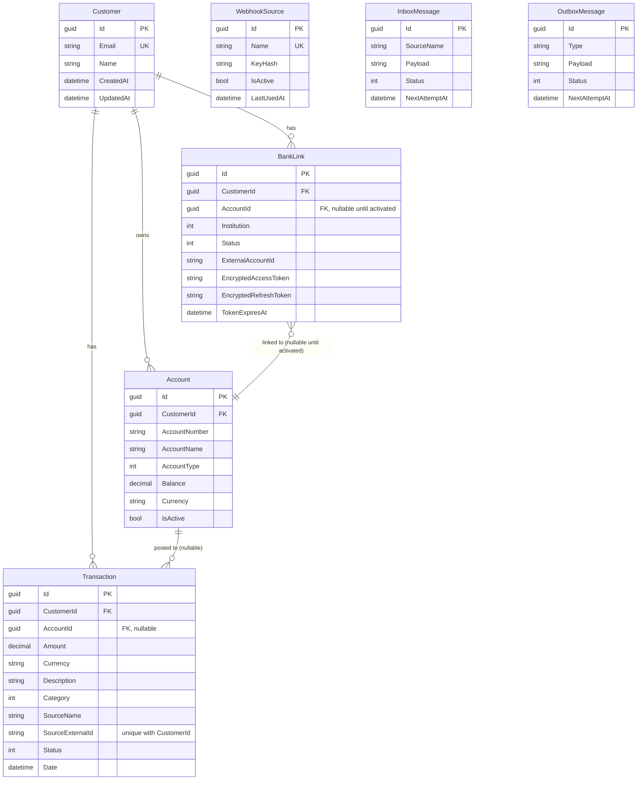
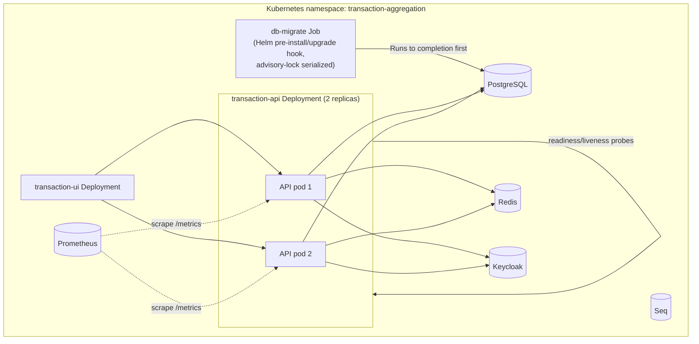

# Architecture

Diagrams for the Transaction Aggregation API (Instructions.md section 39). These
describe what the code actually does; see the [ADRs](adr/README.md) for why
each decision was made, and the [threat model](threat-model.md) for security
analysis.

## System context

## Container / module diagram

One deployable process (modular monolith — [ADR-0001](adr/0001-modular-monolith-not-microservices.md)),
with internal module boundaries enforced by `LayerDependencyTests`, not network
boundaries.

Dependency direction matches the brief's preferred shape (API → Application →
Domain → Ports → Infrastructure Adapters): the Domain project has no reference
to EF Core, ASP.NET Core, or provider-specific packages, and Application only
depends on ports (interfaces) it defines, never on Infrastructure/Persistence
implementations directly.

## Event flow: transaction ingestion

Idempotency is enforced by a database-level unique constraint on
`(CustomerId, Source.ExternalId)`, not just the in-handler dedup check shown
above — see [ADR-0002](adr/0002-postgresql-as-system-of-record.md) for why the
application-level check alone isn't sufficient under concurrent delivery.

## Sequence: bank-link OAuth completion

## Database ERD

`Money` (Amount/Currency) and `TransactionSource` (SourceName/SourceExternalId)
are value objects owned by `Transaction`, not separate tables — see
[ADR-0002](adr/0002-postgresql-as-system-of-record.md) for the decimal-currency
rationale. `InboxMessage`/`OutboxMessage` are deliberately not foreign-keyed to
the entities they describe — see [ADR-0003](adr/0003-polling-inbox-outbox-not-a-broker.md).

## Deployment (Kubernetes)

`db-migrate` runs to completion (Helm hook) before the API Deployment rolls
out — no pod self-migrates in Staging/Production (see the `Program.cs`
`IsDevelopment()` gate and the comment in `k8s/api/deployment.yaml`).
`RollingUpdate` with `maxUnavailable: 0` keeps at least 2 pods serving traffic
during a deploy; the readiness probe (`/health`) keeps a pod out of rotation
until Postgres is reachable, while Redis failures only degrade (not fail) it —
see [ADR-0005](adr/0005-redis-cache-only.md).
