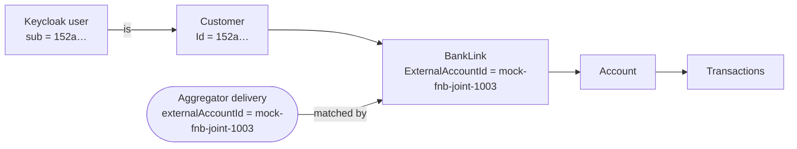
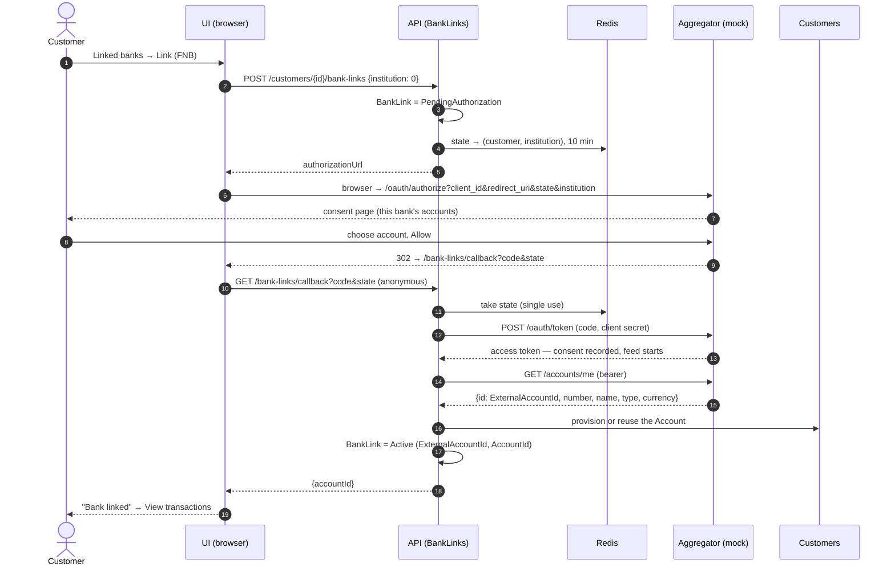
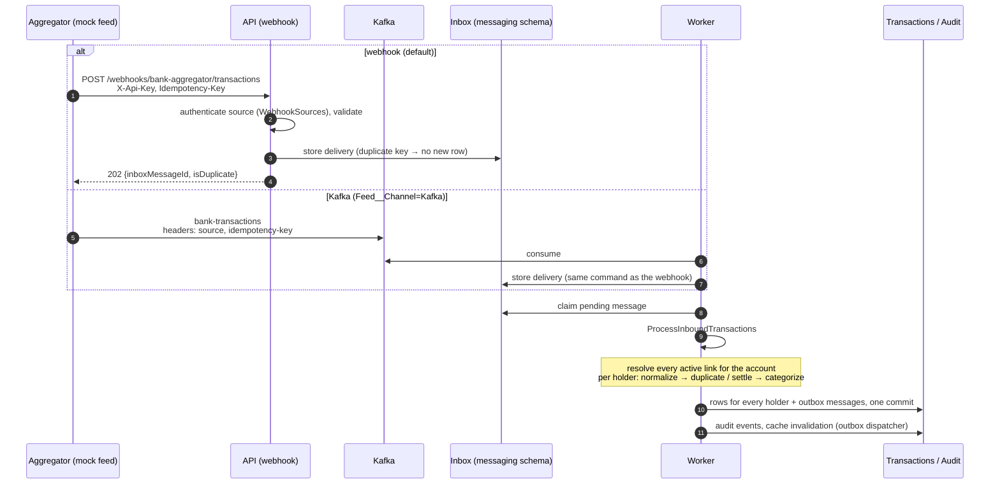

# Bank linking and transaction flow

How a customer links a bank account, and how that account's transactions travel from the
bank to the customer's screen. Everything here was run end to end on the Aspire AppHost on
2026-09-24 — see [Verified run](#verified-run-2026-09-24) for what was checked and what it
showed.

In development the bank side is played by `TransactionAggregation.MockAggregator`; in
production it would be a real account aggregator speaking the same protocol. Nothing in the
application knows the difference.

- [Who is involved](#who-is-involved)
- [Identity: one id from login to data](#identity-one-id-from-login-to-data)
- [1. Linking a bank](#1-linking-a-bank)
- [2. Transactions arriving](#2-transactions-arriving)
- [The pipeline, stage by stage](#the-pipeline-stage-by-stage)
- [Joint accounts](#joint-accounts)
- [Bank formats and normalization](#bank-formats-and-normalization)
- [Run and verify it locally](#run-and-verify-it-locally)
- [Verified run (2026-09-24)](#verified-run-2026-09-24)
- [Found during verification](#found-during-verification)

## Who is involved

| Part | Role in this flow |
|---|---|
| **Customer's browser** | Runs the Blazor UI; is sent to the bank's consent page and back |
| **UI** (`TransactionAggregationUI`) | *Linked banks* page (`/bank-links`) starts a link; `/bank-links/callback` finishes it |
| **Keycloak** | Signs the customer in; the token's `sub` is the customer's id |
| **API** (`TransactionAggregationAPI`) | Hosts every module's HTTP endpoints; receives the webhook |
| **BankLinks module** | Owns the link: consent flow, the bank's account id (`ExternalAccountId`) |
| **Customers module** | Owns customers and accounts; provisions the account a link points at |
| **WebhookSources module** | Authenticates who may push transactions (API key, or Kafka `source` header) |
| **Transactions module** | Inbox, normalization, customer resolution, categorization, storage, totals |
| **Audit module** | Append-only record of every delivery and what happened to it |
| **Worker** (`TransactionAggregation.Worker`) | Kafka consumer and the inbox/outbox dispatchers — where ingestion actually runs |
| **Aggregator** (the mock, in development) | Consent (OAuth) for linking; pushes each linked account's transactions |

## Identity: one id from login to data



A customer's Keycloak user id **is** their `CustomerId` — registration creates the Keycloak
user first and uses its id. Every API request carries a token whose `sub` is that id, and
customer-scoped data is filtered by it. Deliveries never carry a customer: they carry the
bank's account id, and the bank link is what turns that into customers.

## 1. Linking a bank



- The redirect comes back to the **UI**, on the origin the customer signed in on (Aspire:
  `https://localhost:5101`; docker-compose: `http://localhost:7200`), so their session is
  there when they return. The UI then calls the API's anonymous callback with the code and
  state; the state is what ties the link to the customer who started it.
- **Deny** returns `?error=access_denied`; the UI says nothing was linked and the link stays
  `PendingAuthorization`. Starting again issues a fresh state — an abandoned link never
  blocks that bank.
- Linking a bank that is already `Active` is refused (409).
- Code: `InitiateBankLinkCommandHandler`, `CompleteBankLinkCommandHandler`,
  `HttpBankAggregatorClient`, `AccountProvisioningAdapter`; UI `Pages/BankLinks.razor`,
  `Pages/BankLinkCallback.razor`.

## 2. Transactions arriving



Both channels end in the same `ReceiveBankTransactionsCommand` and the same inbox, so
validation, idempotency and everything after are identical whichever way a delivery came.
The API only accepts and stores; the worker does the processing, so a slow ingest never
holds up the sender.

## The pipeline, stage by stage

| Stage | What happens | Where |
|---|---|---|
| **Ingestion** | Webhook or Kafka → validated `ReceiveBankTransactionsCommand` → inbox row. Replays with the same idempotency key (or identical payload) are recognised here | `ReceiveBankTransactions` (Presentation + Application), `BankTransactionsKafkaMessageHandler` |
| **Customer resolution** | The delivery's `externalAccountId` → every **active** bank link for it (oldest first) → customer + account per link | `IBankLinksReadApi.FindActiveLinksByExternalAccountIdAsync` |
| **Normalization** | Per link, with that bank's profile: dates to UTC, descriptions cleaned, currency upper-cased, bank category mapped to ours; originals kept in metadata | `TransactionNormalizer`, `normalization-rules.json` (+ `.Development.json`) |
| **Duplicate / settlement** | Per customer: new id → create (Pending or Settled); a posting for a stored pending row → settle it in place; anything else → duplicate, skipped | `ProcessInboundTransactionsCommandHandler` |
| **Categorization** | Our keyword rules first, then the bank's (mapped) category, then income for money in | `TransactionCategorizationService`, `categorization-rules.json` |
| **Aggregation** | At query time: settled transactions only; pending reported separately | `TransactionTotals`, summary and balance queries |
| **API** | Customer-scoped reads | `GET /customers/{id}/transactions`, `…/filter`, `…/summary`, `…/accounts` |

## Joint accounts

A joint account is linked once per holder, each link carrying the same `ExternalAccountId`.
The aggregator pushes each transaction **once**; the application stores a copy **per
holder**, under that holder's own account, with that holder's own duplicate and settlement
state. All holders' copies commit together, so a retry never finds one holder done and the
other not. A holder who links later receives deliveries from then on; history isn't
backfilled.

## Bank formats and normalization

The mock's formats are **invented** — they exercise normalization, they don't describe the
real banks. Their rules are in `normalization-rules.Development.json`, which only Development
loads; the shipped `normalization-rules.json` has only generic defaults.

| Bank | Sends | Stored as | Category source |
|---|---|---|---|
| FNB | `POS PURCHASE  PICK N PAY  MENLYN`, local time without offset, labels like `Petrol` | `PICK N PAY MENLYN`, UTC | FNB label mapped (`Petrol` → Transportation) |
| Absa | `ABSA CARD Checkers Rosebank`, `+02:00` | `Checkers Rosebank`, UTC | our keyword rules |
| Capitec | `Woolworths Sandton`, UTC, our category names | unchanged | the bank's own category |
| Standard Bank (no profile — "Other") | `PURCHASE Checkers`, local time | `PURCHASE Checkers` — defaults only | keyword rules only |

Whatever the bank sent is kept on the transaction as `bankDescription` / `bankCategory`
metadata whenever normalization changed or used it.

## Run and verify it locally

```powershell
dotnet run --project TransactionAggregationAPI.AppHost --launch-profile https
```

The API is on `https://localhost:5101` (the UI is served from the same origin), the mock
aggregator on `http://localhost:5090`, Keycloak on `http://localhost:8081`. On startup in
Development the API migrates every module, seeds demo customers, and registers the
`mock-aggregator` webhook source.

**In the browser:** sign in as a seed customer (e.g. `thabo.mokoena@example.co.za` /
`Test@12345`), open **Linked banks**, choose **Link**, pick an account on the consent page,
**Allow**. Within a feed interval (30 s) the account's transactions appear.

**From a terminal** (what the verification below used):

```bash
# A customer's token — transaction-perf-test is the realm's direct-grant client
curl -s -X POST http://localhost:8081/realms/transaction-aggregation/protocol/openid-connect/token \
  -d grant_type=password -d client_id=transaction-perf-test \
  --data-urlencode username=thabo.mokoena@example.co.za --data-urlencode password=Test@12345

# Start a link (0 FNB, 1 StandardBank, 2 Absa, 3 Capitec) → authorizationUrl
curl -sk -X POST https://localhost:5101/api/v1/customers/$CUSTOMER_ID/bank-links \
  -H "Authorization: Bearer $TOKEN" -H "Content-Type: application/json" -d '{"institution":0}'

# Consent as the browser would (state from the authorizationUrl) → 302 with code & state
curl -s -o /dev/null -w "%{redirect_url}" -X POST http://localhost:5090/oauth/authorize \
  --data-urlencode client_id=transaction-aggregation-dev \
  --data-urlencode redirect_uri=https://localhost:5101/bank-links/callback \
  --data-urlencode state=$STATE --data-urlencode account_id=mock-fnb-joint-1003 --data-urlencode decision=allow

# Complete, as the UI's callback page does
curl -sk "https://localhost:5101/api/v1/bank-links/callback?code=$CODE&state=$STATE"

# Watch them arrive
curl -sk "https://localhost:5101/api/v1/customers/$CUSTOMER_ID/transactions/filter?source=FNB" \
  -H "Authorization: Bearer $TOKEN"
```

Useful while it runs: `GET http://localhost:5090/consents` (accounts the mock is feeding),
Kafka UI on `http://localhost:8083`, and the `messaging."InboxMessages"` and
`audit."AuditEvents"` tables. To try the Kafka channel, run the mock with
`Feed__Channel=Kafka` and `ConnectionStrings__kafka` set to the broker's advertised host
listener.

## Verified run (2026-09-24)

On a freshly created database, through the Aspire AppHost:

| # | Check | Result |
|---|---|---|
| 1 | Sign-in; token `sub` equals the `CustomerId`, audience `transaction-ui` | ✅ |
| 2 | Start a link: `authorizationUrl` points at the mock, redirect at the UI's https callback | ✅ |
| 3 | Consent page lists the bank's accounts, joint account marked | ✅ |
| 4 | Allow → 302 to `/bank-links/callback?code&state`; that URL serves the UI | ✅ |
| 5 | Callback completes: link `Active`, account provisioned, mock records the consent | ✅ |
| 6 | Second customer links the same joint account: own account, one consent at the mock | ✅ |
| 7 | Mock pushes by webhook: `202 Accepted` | ✅ |
| 8 | Both holders get every transaction on their own accounts; FNB descriptions cleaned, labels mapped, local times stored as the right UTC instant | ✅ |
| 9 | Pending card purchase later posted: settled in place for each holder, not duplicated | ✅ |
| 10 | Inbox messages all `Processed`; audit counts consistent (received ×2, processed ×4 — once per holder) | ✅ |
| 11 | Kafka channel: the mock produces to `bank-transactions`, the worker ingests, source attributed from the header | ✅ |
| 12 | Absa, Capitec and Standard Bank formats normalized as in the table above | ✅ |
| 13 | Deny → back to the UI with `access_denied`; retrying the same bank succeeds | ✅ |
| 14 | Another customer's customer/accounts/transactions/bank-links → 404 | ✅ |

Not covered live: the UI pages were not driven in a real browser (their API calls were each
exercised), and a simulated redelivery (5 % per tick) didn't happen during the run — both
are covered by automated tests.

## Found during verification

Fixed:

- **Migrations weren't running.** The `MigrateAsync` call in `MigrationExtensions` had been
  commented out locally while still logging "applied successfully", so the database stayed
  on an old schema and the API died at startup. Restored; the development database was
  recreated so every module migrated from scratch.
- **Keycloak users were "not fully set up".** The realm requires a last name; users were
  created with the full name as the first name only, so password sign-in was refused and a
  browser sign-in forced a profile form. `KeycloakAdminClient` now splits the name. Users
  created before the fix keep an empty last name until they complete that form or are
  updated through the Keycloak admin API.
- **Callback origin.** Under Aspire the UI signs in on `https://localhost:5101`, so the bank
  link callback now returns there instead of the http port, where there is no session.

Worth knowing:

- For a bank that sends no categories and has no profile, anything our keyword rules don't
  recognise stays **Uncategorized** (e.g. `PURCHASE Mugg & Bean`). Adding keywords — or a
  profile once real feeds are seen — closes that.
